# Pump Fiction Fullstack Architecture Document

## Introduction

This document outlines the complete fullstack architecture for **Pump Fiction**, including backend systems, frontend implementation, and their integration. It serves as the single source of truth for AI-driven development, ensuring consistency across the entire technology stack.

This unified approach combines what would traditionally be separate backend and frontend architecture documents, streamlining the development process for modern fullstack applications where these concerns are increasingly intertwined.

### Starter Template or Existing Project

**Status:** Brownfield Project - Existing codebase in active development

The project is currently in **Phase 0 (MVP)** with authentication features partially implemented:

**Frontend (Flutter):**
- Follows **Reso Coder's Clean Architecture** pattern
- Structure: `features/{feature_name}/{data|domain|presentation}/`
- Riverpod for state management with code generation
- GetIt for dependency injection
- Go Router for navigation

**Backend (FastAPI):**
- Follows **MVC (Model-View-Controller)** pattern
- Structure: `app/{models|controllers|services|repositories|schemas}/`
- Supabase integration for auth and database
- JWT token-based authentication
- Role-based access control (normal_user, trainer, seller, admin)

**Current Implementation Status:**
- ✅ Authentication endpoints (signup, login, refresh, logout)
- ✅ Role application system (users can request role upgrades)
- ✅ Supabase Auth integration
- ⚠️ Frontend authentication UI scaffolding (not yet wired to backend)
- 🚧 Workout, nutrition, and other core features pending

**Architectural Constraints:**
- Must maintain Reso Coder's Clean Architecture on frontend
- Must maintain MVC pattern on backend
- Must use Supabase as primary infrastructure
- Must support cross-platform (iOS + Android) via Flutter

### Change Log

| Date | Version | Description | Author |
|------|---------|-------------|--------|
| 2025-10-14 | 1.0 | Initial architecture document created from existing codebase | Winston (Architect Agent) |

---

## High Level Architecture

### Technical Summary

Pump Fiction employs a **mobile-first fullstack architecture** using Flutter for cross-platform mobile clients and FastAPI for the backend API. The architecture follows established patterns: **Reso Coder's Clean Architecture** on the frontend for maintainable, testable code with clear separation of concerns, and **MVC (Model-View-Controller)** on the backend for straightforward request handling and business logic separation.

The **frontend** communicates with the backend via RESTful JSON APIs over HTTPS, with Riverpod managing application state and providing reactive data flow. **Supabase** serves as the infrastructure backbone, providing PostgreSQL database, authentication services, and file storage. The system is designed for **offline-first** workout logging, with local SQLite storage syncing to the cloud when connectivity is restored.

Key integration points include Supabase Auth for JWT token-based authentication, REST APIs for all data operations, and Firebase Cloud Messaging for push notifications. The architecture prioritizes **developer experience** through dependency injection (GetIt), code generation (Riverpod Generator), and clear architectural boundaries. This design supports the Phase 0 MVP focus on core fitness tracking while establishing patterns that scale through Phases 1-2 for AI features, social engagement, and marketplace functionality.

### Platform and Infrastructure Choice

**Platform:** Supabase (Backend-as-a-Service) + Railway/Render (API Hosting)

**Key Services:**
- **Supabase PostgreSQL** - Primary relational database with pgvector extension for Phase 1 AI
- **Supabase Auth** - JWT-based authentication with OAuth providers
- **Supabase Storage** - File storage for progress photos and trainer media (Phase 1-2)
- **Railway.app or Render** - FastAPI backend hosting (PaaS with free tier)
- **Redis Cloud** - Session management, caching, and Celery task queue
- **Firebase Cloud Messaging (FCM)** - Push notifications for iOS and Android
- **Sentry** - Error tracking and monitoring

**Deployment Host and Regions:**
- **Backend API:** Railway (North America) or Render (Global CDN)
- **Database:** Supabase (US East or closest to target users)
- **Mobile Apps:** App Store (US) + Google Play (Worldwide)

### Repository Structure

**Structure:** Monorepo

**Monorepo Tool:** Not applicable (simple directory-based monorepo)

**Package Organization:**
```
pump-fiction/
├── frontend/          # Flutter mobile app
├── backend/           # FastAPI services
├── docs/              # Shared documentation (PRD, architecture)
├── .github/           # CI/CD workflows
└── infrastructure/    # Future: Docker, deployment configs
```

### High Level Architecture Diagram


### Architectural Patterns

- **Monolithic Backend with Modular Design:** Single FastAPI application organized by domain modules (auth, workouts, nutrition, social, marketplace) - _Rationale:_ Simplifies deployment and debugging for MVP while maintaining clear boundaries for future microservice extraction if Phase 2 marketplace scales independently

- **Clean Architecture (Frontend):** Reso Coder's pattern with Data/Domain/Presentation layers per feature - _Rationale:_ Enforces separation of concerns, makes business logic testable independently of UI/framework, and enables parallel feature development

- **MVC Pattern (Backend):** Controllers handle HTTP, Services contain business logic, Repositories abstract data access - _Rationale:_ Well-understood pattern for web APIs, clear separation of responsibilities, easy for new developers to onboard

- **Offline-First Mobile:** Local SQLite for workout logging with background sync queue - _Rationale:_ Critical for gym environments with poor connectivity, prevents data loss, improves perceived performance

- **Repository Pattern:** Abstract database operations behind interfaces on both frontend and backend - _Rationale:_ Enables unit testing with mock repositories, allows switching data sources (e.g., SQLite → Supabase) without changing business logic

- **Dependency Injection:** GetIt container for Flutter dependency management - _Rationale:_ Loose coupling between layers, testability through mock injection, single source of truth for app-wide dependencies

- **RESTful API with OpenAPI:** JSON-based REST endpoints documented with FastAPI's automatic OpenAPI generation - _Rationale:_ Standard HTTP semantics, well-supported by tooling, automatic interactive documentation, easy frontend integration

---

## Tech Stack

This is the SINGLE SOURCE OF TRUTH for all technology decisions.

### Technology Stack Table

| Category | Technology | Version | Purpose | Rationale |
|----------|-----------|---------|---------|-----------|
| **Frontend Language** | Dart | 3.0+ | Flutter's programming language | Type-safe, null-safe language with excellent tooling and hot reload for rapid development |
| **Frontend Framework** | Flutter | 3.16+ | Cross-platform mobile UI framework | Single codebase for iOS/Android, native performance, rich widget library, strong community |
| **UI Component Library** | Material 3 | Built-in | Design system and UI components | Native Flutter widgets following Material Design 3, no additional dependencies needed |
| **State Management** | Riverpod + Riverpod Generator | 2.4+ | Reactive state management with code generation | Compile-safe providers, excellent testing support, eliminates boilerplate with code generation |
| **Backend Language** | Python | 3.11+ | FastAPI backend implementation | Async/await support, excellent type hints, rich ecosystem for ML (Phase 1), readable syntax |
| **Backend Framework** | FastAPI | 0.104+ | Async REST API framework | Auto-generated OpenAPI docs, high performance, modern async support, Pydantic validation |
| **API Style** | REST (OpenAPI 3.0) | 3.0 | HTTP-based API architecture | Standard HTTP methods, well-documented, wide tooling support, automatic docs from FastAPI |
| **Database** | PostgreSQL (Supabase) | 15+ | Primary relational database | ACID compliance, JSON support, pgvector for AI embeddings (Phase 1), managed by Supabase |
| **Cache** | Redis Cloud | 7.0+ | Session storage, API caching, task queue | In-memory performance, pub/sub for real-time, Celery broker for background jobs |
| **File Storage** | Supabase Storage | N/A | Progress photos, trainer media | Integrated with Supabase auth, S3-compatible API, CDN distribution, automatic image optimization |
| **Authentication** | Supabase Auth | N/A | User authentication and JWT tokens | OAuth providers, email/password, JWT tokens, built-in refresh token rotation, admin API |
| **Frontend Testing** | Flutter Test | Built-in | Unit, widget, and integration tests | Native Flutter testing framework, fast execution, hot reload support |
| **Backend Testing** | pytest + pytest-asyncio | 7.4+ / 0.21+ | Unit and integration tests for FastAPI | Async test support, fixtures, excellent coverage reporting, TestClient for API testing |
| **E2E Testing** | Patrol (Flutter) | 2.0+ | End-to-end mobile app testing | Native gesture support, better than flutter_driver for real-world scenarios, runs on real devices |
| **Build Tool** | Dart Build System | Built-in | Riverpod code generation | Official build_runner for code generation, watches files for changes |
| **Bundler** | Flutter Build | Built-in | Mobile app compilation and bundling | Compiles to native ARM code (iOS/Android), tree-shaking, obfuscation support |
| **IaC Tool** | Docker Compose | 2.0+ | Local dev environment orchestration | Simple multi-container setup for local development (FastAPI + PostgreSQL + Redis) |
| **CI/CD** | GitHub Actions | N/A | Automated testing and deployment | Free for public repos, Flutter/Python workflows available, integrates with Railway/Render |
| **Monitoring** | Sentry | SaaS | Error tracking and performance monitoring | Frontend and backend error capture, release tracking, performance traces |
| **Logging** | Python logging + Supabase Logs | Built-in | Application logs and debugging | Structured logging with JSON formatting, Supabase dashboard for query logs |
| **CSS Framework** | N/A (Flutter Themes) | Built-in | Styling and theming | Flutter uses ThemeData for app-wide styling, not CSS-based |

**Additional Key Dependencies:**

**Frontend (Flutter):**
- `go_router: ^13.0.0` - Declarative routing with deep linking support
- `get_it: ^7.6.0` - Service locator for dependency injection
- `dio: ^5.4.0` - HTTP client with interceptors for auth tokens
- `sqflite: ^2.3.0` - Local SQLite database for offline-first features
- `flutter_riverpod: ^2.4.0` - Riverpod integration for Flutter
- `riverpod_generator: ^2.3.0` - Code generation for Riverpod providers
- `fl_chart: ^0.66.0` - Charts and data visualization
- `firebase_messaging: ^14.7.0` - FCM for push notifications
- `workmanager: ^0.5.0` - Background task scheduling for sync queue

**Backend (Python):**
- `sqlalchemy[asyncio]: ^2.0.0` - Async ORM for PostgreSQL
- `pydantic: ^2.5.0` - Request/response validation and schemas
- `python-jose[cryptography]: ^3.3.0` - JWT token creation and validation
- `supabase: ^2.3.0` - Supabase client SDK
- `celery[redis]: ^5.3.0` - Background task queue for ML predictions and notifications
- `httpx: ^0.26.0` - Async HTTP client for external APIs
- `uvicorn[standard]: ^0.25.0` - ASGI server for FastAPI

---

## Data Models

These are the core business entities shared conceptually between frontend and backend. Focus on **Phase 0 MVP** with notes for Phase 1-2 extensions.

### User

**Purpose:** Core user account with role-based permissions

**Key Attributes:**
- `id`: UUID - Supabase Auth user ID (primary key)
- `email`: String - Unique email address for authentication
- `full_name`: String - Display name
- `role`: Enum (normal_user, trainer, seller, admin) - Access control level
- `created_at`: DateTime - Account creation timestamp
- `updated_at`: DateTime - Last profile modification

#### TypeScript Interface

```typescript
enum UserRole {
  NORMAL_USER = 'normal_user',
  TRAINER = 'trainer',
  SELLER = 'seller',
  ADMIN = 'admin'
}

interface User {
  id: string;
  email: string;
  full_name: string;
  role: UserRole;
  created_at: string; // ISO 8601
  updated_at: string;
}
```

#### Relationships

- Has one `OnboardingProfile` (FR4 - fitness goals, equipment, experience level)
- Has many `Workout` records (FR5)
- Has many `NutritionLog` entries (FR10-FR11)
- Has many `BodyMetric` records (FR14-FR15)
- Has many `RoleApplication` records (role upgrade requests)

---

### OnboardingProfile

**Purpose:** User preferences and goals collected during onboarding (FR4)

**Key Attributes:**
- `user_id`: UUID - Foreign key to User
- `fitness_goal`: Enum (strength, muscle_gain, fat_loss, endurance, general_fitness) - Primary objective
- `experience_level`: Enum (beginner, intermediate, advanced) - Training background
- `available_equipment`: Array<String> - Equipment access (barbell, dumbbells, machines, bodyweight, etc.)
- `training_frequency`: Integer - Workouts per week (1-7)
- `preferred_split`: Enum (ppl, upper_lower, full_body, custom) - Periodization template (FR8)
- `nutrition_goal`: Enum (cut, bulk, recomp, maintain) - Calorie strategy (FR13)
- `tdee`: Float - Total Daily Energy Expenditure (calculated)
- `target_calories`: Integer - Daily calorie target
- `target_macros`: Object {protein: Int, carbs: Int, fats: Int} - Macro breakdown (FR12)

#### TypeScript Interface

```typescript
enum FitnessGoal {
  STRENGTH = 'strength',
  MUSCLE_GAIN = 'muscle_gain',
  FAT_LOSS = 'fat_loss',
  ENDURANCE = 'endurance',
  GENERAL_FITNESS = 'general_fitness'
}

enum ExperienceLevel {
  BEGINNER = 'beginner',
  INTERMEDIATE = 'intermediate',
  ADVANCED = 'advanced'
}

enum TrainingSplit {
  PPL = 'ppl',                  // Push/Pull/Legs
  UPPER_LOWER = 'upper_lower',
  FULL_BODY = 'full_body',
  CUSTOM = 'custom'
}

interface OnboardingProfile {
  user_id: string;
  fitness_goal: FitnessGoal;
  experience_level: ExperienceLevel;
  available_equipment: string[];
  training_frequency: number;
  preferred_split: TrainingSplit;
  nutrition_goal: string;
  tdee: number;
  target_calories: number;
  target_macros: {
    protein: number;
    carbs: number;
    fats: number;
  };
  created_at: string;
  updated_at: string;
}
```

#### Relationships

- Belongs to one `User`

---

### Workout

**Purpose:** Single training session with exercises and sets (FR5-FR7)

**Key Attributes:**
- `id`: UUID - Primary key
- `user_id`: UUID - Foreign key to User
- `title`: String - Workout name (e.g., "Push Day A", "Legs")
- `started_at`: DateTime - When workout began
- `completed_at`: DateTime? - Null if in-progress, set when finished
- `duration_seconds`: Integer - Total workout duration
- `notes`: String? - Optional user notes
- `template_id`: UUID? - Reference to saved template (future feature)

#### TypeScript Interface

```typescript
interface Workout {
  id: string;
  user_id: string;
  title: string;
  started_at: string;
  completed_at: string | null;
  duration_seconds: number;
  notes?: string;
  template_id?: string;
}
```

#### Relationships

- Belongs to one `User`
- Has many `WorkoutExercise` records (exercises performed in this session)
- May reference one `WorkoutTemplate` (future)

---

### WorkoutExercise

**Purpose:** Single exercise within a workout with multiple sets (FR5)

**Key Attributes:**
- `id`: UUID - Primary key
- `workout_id`: UUID - Foreign key to Workout
- `exercise_id`: UUID - Foreign key to Exercise (from library)
- `order_index`: Integer - Position in workout sequence
- `notes`: String? - Exercise-specific notes

#### TypeScript Interface

```typescript
interface WorkoutExercise {
  id: string;
  workout_id: string;
  exercise_id: string;
  order_index: number;
  notes?: string;
}
```

#### Relationships

- Belongs to one `Workout`
- References one `Exercise` (from exercise library)
- Has many `ExerciseSet` records

---

### ExerciseSet

**Purpose:** Individual set within an exercise with performance tracking (FR5)

**Key Attributes:**
- `id`: UUID - Primary key
- `workout_exercise_id`: UUID - Foreign key to WorkoutExercise
- `set_number`: Integer - Set index (1, 2, 3, etc.)
- `reps`: Integer - Repetitions completed
- `weight_kg`: Float - Weight used (stored in kg, display converted to user preference)
- `rpe`: Float? - Rate of Perceived Exertion (6-10 scale) (FR5)
- `rir`: Integer? - Reps in Reserve (0-5) (FR5)
- `is_warmup`: Boolean - Whether this is a warmup set
- `is_pr`: Boolean - Auto-detected personal record (FR7)
- `completed_at`: DateTime - Timestamp for rest timer calculations

#### TypeScript Interface

```typescript
interface ExerciseSet {
  id: string;
  workout_exercise_id: string;
  set_number: number;
  reps: number;
  weight_kg: number;
  rpe?: number;        // 6.0 - 10.0
  rir?: number;        // 0 - 5
  is_warmup: boolean;
  is_pr: boolean;
  completed_at: string;
}
```

#### Relationships

- Belongs to one `WorkoutExercise`

---

### Exercise

**Purpose:** Exercise library (system-provided + user-created)

**Key Attributes:**
- `id`: UUID - Primary key
- `name`: String - Exercise name (e.g., "Barbell Bench Press")
- `category`: Enum (chest, back, legs, shoulders, arms, core, cardio, olympic) - Muscle group
- `equipment`: Array<String> - Required equipment (barbell, dumbbells, machine, bodyweight, etc.)
- `difficulty`: Enum (beginner, intermediate, advanced) - Skill requirement
- `instructions`: String? - How to perform
- `video_url`: String? - Tutorial video link
- `is_custom`: Boolean - User-created vs system exercise
- `created_by_user_id`: UUID? - If custom exercise, creator's ID

#### TypeScript Interface

```typescript
enum ExerciseCategory {
  CHEST = 'chest',
  BACK = 'back',
  LEGS = 'legs',
  SHOULDERS = 'shoulders',
  ARMS = 'arms',
  CORE = 'core',
  CARDIO = 'cardio',
  OLYMPIC = 'olympic'
}

interface Exercise {
  id: string;
  name: string;
  category: ExerciseCategory;
  equipment: string[];
  difficulty: ExperienceLevel;
  instructions?: string;
  video_url?: string;
  is_custom: boolean;
  created_by_user_id?: string;
}
```

#### Relationships

- May be created by one `User` (if custom)
- Referenced by many `WorkoutExercise` records

---

### NutritionLog

**Purpose:** Daily food log entry (FR10-FR11)

**Key Attributes:**
- `id`: UUID - Primary key
- `user_id`: UUID - Foreign key to User
- `date`: Date - Log date (YYYY-MM-DD)
- `meal_type`: Enum (breakfast, lunch, dinner, snack) - Meal category
- `food_name`: String - Food item name
- `serving_size`: Float - Amount consumed
- `serving_unit`: String - Unit (g, oz, cup, item, etc.)
- `calories`: Integer - Total calories
- `protein_g`: Float - Protein in grams
- `carbs_g`: Float - Carbohydrates in grams
- `fats_g`: Float - Fats in grams
- `barcode`: String? - If scanned via barcode (FR10)
- `external_food_id`: String? - Open Food Facts ID
- `logged_at`: DateTime - Entry timestamp

#### TypeScript Interface

```typescript
enum MealType {
  BREAKFAST = 'breakfast',
  LUNCH = 'lunch',
  DINNER = 'dinner',
  SNACK = 'snack'
}

interface NutritionLog {
  id: string;
  user_id: string;
  date: string;       // YYYY-MM-DD
  meal_type: MealType;
  food_name: string;
  serving_size: number;
  serving_unit: string;
  calories: number;
  protein_g: number;
  carbs_g: number;
  fats_g: number;
  barcode?: string;
  external_food_id?: string;
  logged_at: string;
}
```

#### Relationships

- Belongs to one `User`

---

### BodyMetric

**Purpose:** Track body measurements and wellness metrics (FR14-FR15)

**Key Attributes:**
- `id`: UUID - Primary key
- `user_id`: UUID - Foreign key to User
- `date`: Date - Measurement date
- `weight_kg`: Float? - Body weight in kg
- `body_fat_percentage`: Float? - Body fat % (future: smart scale integration)
- `water_intake_ml`: Integer? - Daily hydration (FR15)
- `sleep_hours`: Float? - Sleep duration (FR15)
- `notes`: String? - Additional context

#### TypeScript Interface

```typescript
interface BodyMetric {
  id: string;
  user_id: string;
  date: string;       // YYYY-MM-DD
  weight_kg?: number;
  body_fat_percentage?: number;
  water_intake_ml?: number;
  sleep_hours?: number;
  notes?: string;
}
```

#### Relationships

- Belongs to one `User`

---

### RoleApplication

**Purpose:** User requests to upgrade role (trainer/seller) with admin approval workflow

**Key Attributes:**
- `id`: UUID - Primary key
- `user_id`: UUID - Foreign key to User
- `requested_role`: Enum (trainer, seller) - Role being requested
- `current_role`: Enum (normal_user) - Current role at time of application
- `status`: Enum (pending, approved, rejected) - Application state
- `reason`: String - Why user wants this role
- `qualifications`: String? - Certifications, experience, portfolio links
- `admin_notes`: String? - Admin review notes
- `created_at`: DateTime - Application submission time
- `reviewed_at`: DateTime? - When admin made decision

#### TypeScript Interface

```typescript
enum ApplicationStatus {
  PENDING = 'pending',
  APPROVED = 'approved',
  REJECTED = 'rejected'
}

interface RoleApplication {
  id: string;
  user_id: string;
  requested_role: UserRole.TRAINER | UserRole.SELLER;
  current_role: UserRole;
  status: ApplicationStatus;
  reason: string;
  qualifications?: string;
  admin_notes?: string;
  created_at: string;
  reviewed_at?: string;
}
```

#### Relationships

- Belongs to one `User`

---

## API Specification

REST API with OpenAPI 3.0 specification covering Phase 0 MVP endpoints.

### REST API Specification

```yaml
openapi: 3.0.0
info:
  title: Pump Fiction API
  version: 1.0.0
  description: |
    RESTful API for Pump Fiction fitness tracking platform.

    **Authentication:** All protected endpoints require JWT Bearer token in Authorization header.

    **Base URL:** https://api.pumpfiction.app (production) or http://localhost:8000 (local)

    **Rate Limiting:** 100 requests/minute per user (NFR8)

servers:
  - url: https://api.pumpfiction.app/api/v1
    description: Production server
  - url: http://localhost:8000/api/v1
    description: Local development server

tags:
  - name: Authentication
    description: User registration, login, and session management (FR1-FR3, FR17)
  - name: Profile
    description: User profile and onboarding (FR4)
  - name: Workouts
    description: Workout logging and history (FR5-FR9)
  - name: Nutrition
    description: Food logging and macro tracking (FR10-FR13)
  - name: Body Metrics
    description: Weight, hydration, and sleep tracking (FR14-FR15)
  - name: Data Export
    description: GDPR data export and account deletion (FR16-FR17)

# Full specification available at: docs/api/openapi.yaml
# Key endpoints documented below for architecture reference

paths:
  /auth/signup:
    post:
      summary: Register new user account (FR1)
      responses:
        '201':
          description: User created successfully with JWT tokens

  /auth/login:
    post:
      summary: Authenticate user (FR2)
      responses:
        '200':
          description: Login successful with JWT tokens

  /auth/me:
    get:
      summary: Get current user profile
      security:
        - BearerAuth: []

  /profile/onboarding:
    post:
      summary: Complete onboarding flow (FR4)
      description: Calculates TDEE and macro targets based on user inputs

  /workouts:
    post:
      summary: Start new workout (FR5)
    get:
      summary: Get workout history with pagination (FR6)

  /workouts/{workout_id}/exercises/{exercise_id}/sets:
    post:
      summary: Log exercise set with automatic PR detection (FR5, FR7)

  /nutrition/log:
    post:
      summary: Log food entry (FR10-FR11)

  /nutrition/barcode/{barcode}:
    get:
      summary: Lookup food by barcode (FR10)

  /body-metrics:
    post:
      summary: Log body metrics (FR14-FR15)
```

**Full API specification with complete request/response schemas is available in the codebase at: `docs/api/openapi.yaml`**

---

## Components

Major logical components/services across both frontend and backend.

### Flutter Mobile App (Frontend)

**Responsibility:** Cross-platform mobile UI, offline-first data storage, local state management, and user interaction handling. Implements Clean Architecture with feature-based organization.

**Key Interfaces:**
- Exposes UI screens via Go Router navigation
- Consumes REST API via Dio HTTP client
- Stores data locally via SQLite (sqflite)
- Manages state via Riverpod providers
- Receives push notifications via FCM

**Dependencies:**
- Backend REST API (data sync)
- Supabase Auth (token validation)
- Firebase Cloud Messaging (notifications)
- Local SQLite database (offline storage)

**Technology Stack:** Flutter 3.16+, Dart 3.0+, Riverpod 2.4+, GetIt DI, Go Router, Dio, sqflite

**Internal Structure (Reso Coder's Clean Architecture):**
```
lib/
├── core/                          # Shared utilities
│   ├── error/                     # Failure classes
│   ├── network/                   # API client setup
│   ├── router/                    # Go Router config
│   └── constants/                 # App-wide constants
├── features/
│   ├── authentication/
│   │   ├── data/
│   │   │   ├── models/           # User DTO (JSON serialization)
│   │   │   ├── datasources/      # Remote (API) & Local (SQLite)
│   │   │   └── repositories/     # Repository implementation
│   │   ├── domain/
│   │   │   ├── entities/         # User business object
│   │   │   ├── repositories/     # Repository interface
│   │   │   └── usecases/         # LoginUseCase, SignupUseCase
│   │   └── presentation/
│   │       ├── providers/        # Riverpod StateNotifiers
│   │       ├── pages/            # LoginPage, SignupPage
│   │       └── widgets/          # Reusable auth widgets
│   ├── workouts/
│   │   └── [same structure]
│   ├── nutrition/
│   │   └── [same structure]
│   └── profile/
│       └── [same structure]
└── injection_container.dart       # GetIt DI setup
```

---

### FastAPI Backend (Backend API)

**Responsibility:** REST API server handling business logic, data persistence, authentication, and external service integration. Implements MVC pattern with service layer.

**Key Interfaces:**
- Exposes REST API endpoints (OpenAPI 3.0 spec)
- Consumes Supabase Auth API (JWT validation)
- Consumes PostgreSQL database (via SQLAlchemy ORM)
- Consumes Redis (caching, sessions, task queue)
- Publishes to Celery task queue (background jobs)

**Dependencies:**
- Supabase Auth (token validation)
- Supabase PostgreSQL (data storage)
- Redis Cloud (cache & queue)
- Open Food Facts API (nutrition data)
- Sentry (error tracking)

**Technology Stack:** Python 3.11+, FastAPI 0.104+, SQLAlchemy 2.0, Pydantic 2.5+, Celery, uvicorn

**Internal Structure (MVC Pattern):**
```
app/
├── main.py                        # FastAPI app factory
├── routers.py                     # Route aggregation
├── core/
│   ├── config.py                 # Settings (env vars)
│   ├── database.py               # SQLAlchemy session
│   ├── security.py               # JWT utils
│   ├── dependencies.py           # Auth dependencies
│   └── supabase_client.py        # Supabase SDK
├── controllers/
│   ├── auth_controller.py        # Auth endpoints (signup, login)
│   ├── workout_controller.py     # Workout endpoints
│   ├── nutrition_controller.py   # Nutrition endpoints
│   └── profile_controller.py     # Profile/onboarding endpoints
├── services/
│   ├── auth_service.py           # Auth business logic
│   ├── workout_service.py        # Workout logic, PR detection
│   ├── nutrition_service.py      # Macro calculations, TDEE
│   └── external_api_service.py   # Open Food Facts proxy
├── repositories/
│   ├── user_repository.py        # User CRUD operations
│   ├── workout_repository.py     # Workout queries
│   └── nutrition_repository.py   # Nutrition queries
├── models/
│   ├── user_model.py             # SQLAlchemy User model
│   ├── workout_model.py          # Workout, Exercise, Set models
│   └── nutrition_model.py        # NutritionLog model
└── schemas/
    ├── auth_schema.py            # Pydantic request/response schemas
    ├── workout_schema.py
    └── nutrition_schema.py
```

---

### Other Key Components

**Supabase PostgreSQL** - Persistent relational data storage with UUID primary keys, JSONB columns for flexibility, and Row-Level Security policies

**Supabase Auth** - JWT token management with 15min access tokens and 7-day refresh tokens

**Redis Cloud** - Session storage (7-day TTL), API caching (1-hour TTL), and Celery message broker

**Celery Workers** - Background job execution for ML predictions, push notifications, and data exports (Phase 1+)

**Firebase Cloud Messaging** - Cross-platform push notifications for workout reminders, PR achievements, and streak milestones

**Open Food Facts API** - Nutrition database proxy with Redis caching (24-hour TTL)

---

### Component Diagram


---

## Core Workflows

Sequence diagrams showing component interactions for critical user journeys.

### Workflow 1: User Registration and Authentication


### Workflow 2: Offline-First Workout Logging


### Workflow 3: Personal Record (PR) Detection

```mermaid
sequenceDiagram
    participant FlutterApp
    participant FastAPI
    participant WorkoutService
    participant WorkoutRepository
    participant PostgreSQL
    participant FCM

    FlutterApp->>FastAPI: POST /workouts/{id}/exercises/{id}/sets<br/>{reps: 8, weight_kg: 100}
    FastAPI->>WorkoutService: log_set(user_id, exercise_id, reps, weight)

    WorkoutService->>WorkoutRepository: get_exercise_history(user_id, exercise_id)
    WorkoutRepository->>PostgreSQL: Query max weight for exercise
    PostgreSQL-->>WorkoutRepository: Previous best: 95kg x 8 reps
    WorkoutRepository-->>WorkoutService: Historical performance data

    WorkoutService->>WorkoutService: Compare: 100kg > 95kg → PR detected!
    WorkoutService->>WorkoutService: Calculate estimated 1RM (Epley formula)

    WorkoutService->>WorkoutRepository: create_set(is_pr: true)
    WorkoutRepository->>PostgreSQL: INSERT exercise_set (is_pr: true)

    WorkoutService->>FCM: send_notification(user_id, "New PR! Bench Press 100kg x 8")
    FCM-->>FlutterApp: Push notification

    WorkoutService-->>FastAPI: Set object {is_pr: true, e1rm: 125.5kg}
    FastAPI-->>FlutterApp: 201 Created {set}

    FlutterApp->>FlutterApp: Trigger confetti animation
    FlutterApp-->>FlutterApp: Display PR badge on set
```



---

## Database Schema

PostgreSQL schema with tables, constraints, and indexes for Phase 0 MVP.

```sql
-- =====================================================
-- PUMP FICTION DATABASE SCHEMA
-- PostgreSQL 15+ (Supabase)
-- Phase 0: MVP Tables
-- =====================================================

-- Enable required extensions
CREATE EXTENSION IF NOT EXISTS "uuid-ossp";
CREATE EXTENSION IF NOT EXISTS "pg_trgm";  -- Fuzzy text search

-- =====================================================
-- ENUM TYPES
-- =====================================================

CREATE TYPE user_role_enum AS ENUM (
    'normal_user', 'trainer', 'seller', 'admin'
);

CREATE TYPE fitness_goal_enum AS ENUM (
    'strength', 'muscle_gain', 'fat_loss', 'endurance', 'general_fitness'
);

CREATE TYPE experience_level_enum AS ENUM (
    'beginner', 'intermediate', 'advanced'
);

CREATE TYPE training_split_enum AS ENUM (
    'ppl', 'upper_lower', 'full_body', 'custom'
);

CREATE TYPE exercise_category_enum AS ENUM (
    'chest', 'back', 'legs', 'shoulders', 'arms', 'core', 'cardio', 'olympic'
);

CREATE TYPE meal_type_enum AS ENUM (
    'breakfast', 'lunch', 'dinner', 'snack'
);

CREATE TYPE application_status_enum AS ENUM (
    'pending', 'approved', 'rejected'
);

-- =====================================================
-- CORE TABLES
-- =====================================================

CREATE TABLE users (
    id UUID PRIMARY KEY DEFAULT uuid_generate_v4(),
    email VARCHAR(255) UNIQUE NOT NULL,
    full_name VARCHAR(255) NOT NULL,
    role user_role_enum NOT NULL DEFAULT 'normal_user',
    created_at TIMESTAMPTZ NOT NULL DEFAULT NOW(),
    updated_at TIMESTAMPTZ NOT NULL DEFAULT NOW(),
    deleted_at TIMESTAMPTZ NULL
);

CREATE TABLE onboarding_profiles (
    user_id UUID PRIMARY KEY REFERENCES users(id) ON DELETE CASCADE,
    fitness_goal fitness_goal_enum NOT NULL,
    experience_level experience_level_enum NOT NULL,
    available_equipment TEXT[] NOT NULL DEFAULT '{}',
    training_frequency INTEGER NOT NULL CHECK (training_frequency BETWEEN 1 AND 7),
    preferred_split training_split_enum NOT NULL,
    nutrition_goal nutrition_goal_enum NOT NULL DEFAULT 'maintain',
    tdee INTEGER,
    target_calories INTEGER NOT NULL,
    target_protein_g INTEGER NOT NULL,
    target_carbs_g INTEGER NOT NULL,
    target_fats_g INTEGER NOT NULL,
    created_at TIMESTAMPTZ NOT NULL DEFAULT NOW(),
    updated_at TIMESTAMPTZ NOT NULL DEFAULT NOW()
);

CREATE TABLE exercises (
    id UUID PRIMARY KEY DEFAULT uuid_generate_v4(),
    name VARCHAR(255) NOT NULL,
    category exercise_category_enum NOT NULL,
    equipment TEXT[] NOT NULL DEFAULT '{}',
    difficulty experience_level_enum NOT NULL DEFAULT 'beginner',
    instructions TEXT,
    video_url VARCHAR(512),
    is_custom BOOLEAN NOT NULL DEFAULT FALSE,
    created_by_user_id UUID REFERENCES users(id) ON DELETE SET NULL,
    created_at TIMESTAMPTZ NOT NULL DEFAULT NOW(),
    CONSTRAINT unique_exercise_name UNIQUE NULLS NOT DISTINCT (name, created_by_user_id)
);

CREATE TABLE workouts (
    id UUID PRIMARY KEY DEFAULT uuid_generate_v4(),
    user_id UUID NOT NULL REFERENCES users(id) ON DELETE CASCADE,
    title VARCHAR(255) NOT NULL,
    started_at TIMESTAMPTZ NOT NULL DEFAULT NOW(),
    completed_at TIMESTAMPTZ,
    duration_seconds INTEGER,
    notes TEXT,
    template_id UUID,
    created_at TIMESTAMPTZ NOT NULL DEFAULT NOW(),
    updated_at TIMESTAMPTZ NOT NULL DEFAULT NOW(),
    deleted_at TIMESTAMPTZ NULL
);

CREATE TABLE workout_exercises (
    id UUID PRIMARY KEY DEFAULT uuid_generate_v4(),
    workout_id UUID NOT NULL REFERENCES workouts(id) ON DELETE CASCADE,
    exercise_id UUID NOT NULL REFERENCES exercises(id) ON DELETE RESTRICT,
    order_index INTEGER NOT NULL,
    notes TEXT,
    created_at TIMESTAMPTZ NOT NULL DEFAULT NOW(),
    CONSTRAINT unique_workout_exercise_order UNIQUE (workout_id, order_index)
);

CREATE TABLE exercise_sets (
    id UUID PRIMARY KEY DEFAULT uuid_generate_v4(),
    workout_exercise_id UUID NOT NULL REFERENCES workout_exercises(id) ON DELETE CASCADE,
    set_number INTEGER NOT NULL,
    reps INTEGER NOT NULL CHECK (reps > 0),
    weight_kg DECIMAL(6,2) NOT NULL CHECK (weight_kg >= 0),
    rpe DECIMAL(3,1) CHECK (rpe BETWEEN 6.0 AND 10.0),
    rir INTEGER CHECK (rir BETWEEN 0 AND 5),
    is_warmup BOOLEAN NOT NULL DEFAULT FALSE,
    is_pr BOOLEAN NOT NULL DEFAULT FALSE,
    completed_at TIMESTAMPTZ NOT NULL DEFAULT NOW(),
    CONSTRAINT unique_workout_exercise_set UNIQUE (workout_exercise_id, set_number)
);

CREATE TABLE nutrition_logs (
    id UUID PRIMARY KEY DEFAULT uuid_generate_v4(),
    user_id UUID NOT NULL REFERENCES users(id) ON DELETE CASCADE,
    date DATE NOT NULL,
    meal_type meal_type_enum NOT NULL,
    food_name VARCHAR(255) NOT NULL,
    serving_size DECIMAL(8,2) NOT NULL,
    serving_unit VARCHAR(50) NOT NULL,
    calories INTEGER NOT NULL CHECK (calories >= 0),
    protein_g DECIMAL(6,2) NOT NULL CHECK (protein_g >= 0),
    carbs_g DECIMAL(6,2) NOT NULL CHECK (carbs_g >= 0),
    fats_g DECIMAL(6,2) NOT NULL CHECK (fats_g >= 0),
    barcode VARCHAR(50),
    external_food_id VARCHAR(100),
    logged_at TIMESTAMPTZ NOT NULL DEFAULT NOW(),
    created_at TIMESTAMPTZ NOT NULL DEFAULT NOW(),
    updated_at TIMESTAMPTZ NOT NULL DEFAULT NOW(),
    deleted_at TIMESTAMPTZ NULL
);

CREATE TABLE body_metrics (
    id UUID PRIMARY KEY DEFAULT uuid_generate_v4(),
    user_id UUID NOT NULL REFERENCES users(id) ON DELETE CASCADE,
    date DATE NOT NULL,
    weight_kg DECIMAL(5,2) CHECK (weight_kg > 0 AND weight_kg < 500),
    body_fat_percentage DECIMAL(4,2) CHECK (body_fat_percentage BETWEEN 0 AND 100),
    water_intake_ml INTEGER CHECK (water_intake_ml >= 0),
    sleep_hours DECIMAL(3,1) CHECK (sleep_hours BETWEEN 0 AND 24),
    notes TEXT,
    created_at TIMESTAMPTZ NOT NULL DEFAULT NOW(),
    CONSTRAINT unique_user_date_metric UNIQUE (user_id, date)
);

CREATE TABLE role_applications (
    id UUID PRIMARY KEY DEFAULT uuid_generate_v4(),
    user_id UUID NOT NULL REFERENCES users(id) ON DELETE CASCADE,
    user_email VARCHAR(255) NOT NULL,
    user_name VARCHAR(255) NOT NULL,
    requested_role user_role_enum NOT NULL CHECK (requested_role IN ('trainer', 'seller')),
    current_role user_role_enum NOT NULL,
    status application_status_enum NOT NULL DEFAULT 'pending',
    reason TEXT NOT NULL,
    qualifications TEXT,
    admin_notes TEXT,
    reviewed_by_admin_id UUID REFERENCES users(id) ON DELETE SET NULL,
    created_at TIMESTAMPTZ NOT NULL DEFAULT NOW(),
    updated_at TIMESTAMPTZ NOT NULL DEFAULT NOW(),
    reviewed_at TIMESTAMPTZ,
    CONSTRAINT unique_pending_application UNIQUE (user_id, status) WHERE (status = 'pending')
);

-- =====================================================
-- INDEXES FOR PERFORMANCE
-- =====================================================

CREATE INDEX idx_users_email ON users(email) WHERE deleted_at IS NULL;
CREATE INDEX idx_workouts_user_date ON workouts(user_id, started_at DESC) WHERE deleted_at IS NULL;
CREATE INDEX idx_nutrition_logs_user_date ON nutrition_logs(user_id, date DESC) WHERE deleted_at IS NULL;
CREATE INDEX idx_body_metrics_user_date ON body_metrics(user_id, date DESC);
CREATE INDEX idx_exercises_name_trgm ON exercises USING gin (name gin_trgm_ops);

-- =====================================================
-- ROW LEVEL SECURITY (RLS) POLICIES
-- =====================================================

ALTER TABLE workouts ENABLE ROW LEVEL SECURITY;
ALTER TABLE nutrition_logs ENABLE ROW LEVEL SECURITY;
ALTER TABLE body_metrics ENABLE ROW LEVEL SECURITY;

-- Example: Users can only see their own workouts
CREATE POLICY workouts_user_isolation ON workouts
    FOR ALL
    USING (auth.uid() = user_id)
    WITH CHECK (auth.uid() = user_id);
```

**Full database schema with all triggers, seed data, and comments is available in: `backend/alembic/versions/`**

---

## Frontend Architecture (Flutter)

### Component Organization

Clean Architecture with feature-based modules:

```
lib/
├── core/
│   ├── constants/         # API endpoints, theme colors
│   ├── error/             # Failure classes
│   ├── network/           # Dio client with interceptors
│   ├── router/            # Go Router configuration
│   └── widgets/           # Reusable UI components
├── features/
│   └── {feature}/
│       ├── data/
│       │   ├── models/             # JSON serialization
│       │   ├── datasources/        # Remote & Local data sources
│       │   └── repositories/       # Repository implementation
│       ├── domain/
│       │   ├── entities/           # Pure business objects
│       │   ├── repositories/       # Repository interfaces
│       │   └── usecases/           # Single-responsibility use cases
│       └── presentation/
│           ├── providers/          # Riverpod state management
│           ├── pages/              # Full screen widgets
│           └── widgets/            # Feature-specific widgets
└── injection_container.dart        # GetIt dependency injection
```

### State Management

**Riverpod with Code Generation** for compile-time safety:

```dart
@riverpod
class WorkoutNotifier extends _$WorkoutNotifier {
  @override
  AsyncValue<List<Workout>> build() {
    _loadWorkouts();
    return const AsyncValue.loading();
  }

  Future<void> createWorkout(String title) async {
    final createUseCase = ref.read(createWorkoutUseCaseProvider);
    final result = await createUseCase(CreateWorkoutParams(title: title));

    result.fold(
      (failure) => state = AsyncValue.error(failure, StackTrace.current),
      (workout) => state.whenData((workouts) =>
        AsyncValue.data([workout, ...workouts])
      ),
    );
  }
}
```

### Routing

**Go Router** for declarative routing with authentication guards:

```dart
final appRouter = GoRouter(
  initialLocation: '/splash',
  routes: [
    GoRoute(path: '/login', builder: (context, state) => LoginPage()),
    ShellRoute(
      builder: (context, state, child) => MainScaffold(child: child),
      routes: [
        GoRoute(path: '/home', builder: (context, state) => HomePage()),
        GoRoute(path: '/workouts', builder: (context, state) => WorkoutListPage()),
      ],
    ),
  ],
  redirect: (context, state) {
    final isAuthenticated = /* check auth */;
    if (!isAuthenticated && !state.matchedLocation.startsWith('/login')) {
      return '/login';
    }
    return null;
  },
);
```

### API Client

**Dio with interceptors** for auth token injection and automatic refresh:

```dart
class AuthInterceptor extends Interceptor {
  @override
  void onRequest(RequestOptions options, RequestInterceptorHandler handler) async {
    final token = await getAccessToken();
    if (token != null) {
      options.headers['Authorization'] = 'Bearer $token';
    }
    handler.next(options);
  }

  @override
  void onError(DioException err, ErrorInterceptorHandler handler) async {
    if (err.response?.statusCode == 401) {
      // Refresh token and retry request
      final newToken = await refreshToken();
      if (newToken != null) {
        final options = err.requestOptions;
        options.headers['Authorization'] = 'Bearer $newToken';
        final response = await dio.fetch(options);
        return handler.resolve(response);
      }
    }
    handler.next(err);
  }
}
```

---

## Backend Architecture (FastAPI)

### MVC Structure

Controllers (thin HTTP handlers), Services (business logic), Repositories (data access):

```python
# Controller (HTTP layer)
@router.post('/workouts', response_model=WorkoutResponse, status_code=201)
async def create_workout(
    workout_data: WorkoutCreate,
    current_user: dict = Depends(get_current_user),
    db: AsyncSession = Depends(get_db)
):
    workout_service = WorkoutService(WorkoutRepository(db))
    workout = await workout_service.create_workout(
        user_id=current_user["id"],
        title=workout_data.title
    )
    return workout

# Service (business logic layer)
class WorkoutService:
    def __init__(self, repo: WorkoutRepository):
        self.repo = repo

    async def create_workout(self, user_id: UUID, title: str) -> Workout:
        # Business logic here
        workout = await self.repo.create_workout(user_id, title)
        return workout

    async def log_set(self, workout_id: UUID, set_data: dict) -> ExerciseSet:
        # PR detection logic
        history = await self.repo.get_exercise_history(user_id, exercise_id)
        is_pr = self._detect_pr(set_data, history)
        return await self.repo.create_set(..., is_pr=is_pr)

# Repository (data access layer)
class WorkoutRepository:
    def __init__(self, db: AsyncSession):
        self.db = db

    async def create_workout(self, user_id: UUID, title: str) -> Workout:
        workout = Workout(user_id=user_id, title=title, started_at=datetime.utcnow())
        self.db.add(workout)
        await self.db.commit()
        await self.db.refresh(workout)
        return workout
```

### Authentication Middleware

**Dependency injection** for authentication and authorization:

```python
from fastapi import Depends, HTTPException
from fastapi.security import HTTPBearer

security = HTTPBearer()

async def get_current_user(
    credentials: HTTPAuthorizationCredentials = Depends(security)
) -> Dict[str, Any]:
    token = credentials.credentials
    auth_service = AuthService()
    user = await auth_service.get_user_from_token(token)

    if not user:
        raise HTTPException(status_code=401, detail="Invalid token")

    return user

async def require_admin(
    current_user: Dict = Depends(get_current_user)
) -> Dict:
    if current_user.get("role") != "admin":
        raise HTTPException(status_code=403, detail="Admin access required")
    return current_user

# Usage in controllers
@router.get('/admin/applications')
async def get_applications(admin: dict = Depends(require_admin)):
    # Only admins can access this endpoint
    pass
```

---

## Unified Project Structure

```plaintext
pump-fiction/
├── .github/workflows/              # CI/CD
│   ├── backend-ci.yml
│   ├── frontend-ci.yml
│   └── deploy.yml
├── frontend/                       # Flutter app
│   ├── lib/
│   │   ├── core/
│   │   ├── features/
│   │   └── main.dart
│   ├── test/
│   └── pubspec.yaml
├── backend/                        # FastAPI
│   ├── app/
│   │   ├── controllers/
│   │   ├── services/
│   │   ├── repositories/
│   │   ├── models/
│   │   ├── schemas/
│   │   └── main.py
│   ├── tests/
│   ├── alembic/
│   └── requirements.txt
├── docs/                           # Documentation
│   ├── prd.md
│   ├── architecture.md
│   └── api/
├── scripts/                        # Dev scripts
│   ├── setup-dev.sh
│   └── run-backend.sh
├── docker-compose.yml              # Local dev services
└── README.md
```

---

## Development Workflow

### Local Setup

```bash
# Backend
cd backend
python -m venv venv
source venv/bin/activate
pip install -r requirements.txt
cp .env.example .env  # Edit with Supabase credentials
docker-compose up -d  # Start PostgreSQL + Redis
alembic upgrade head

# Frontend
cd frontend
flutter pub get
dart run build_runner build --delete-conflicting-outputs
flutter run
```

### Development Commands

```bash
# Backend
uvicorn app.main:app --reload  # Dev server
pytest tests/ -v --cov=app     # Tests
black app/ && ruff app/        # Format & lint
alembic revision --autogenerate -m "Description"  # Migration

# Frontend
flutter run                     # Run app
flutter test                    # Unit tests
flutter test integration_test/  # Integration tests
dart run build_runner watch     # Code generation
dart format lib/ && flutter analyze  # Format & analyze
```

### Environment Variables

```bash
# Backend (.env)
SUPABASE_URL=https://your-project.supabase.co
SUPABASE_SERVICE_KEY=your_service_key
SECRET_KEY=your-secret-key-min-32-chars
DATABASE_URL=postgresql+asyncpg://...
REDIS_URL=redis://localhost:6379/0

# Frontend (lib/core/constants/env.dart)
const String apiBaseUrl = 'http://localhost:8000/api/v1';  // Dev
```

---

## Deployment Architecture

### Deployment Strategy

**Frontend:**
- Platform: App Store (iOS) + Google Play (Android)
- Build: `flutter build apk --release` / `flutter build ipa`
- Tool: Fastlane for automated builds and uploads

**Backend:**
- Platform: Railway.app or Render.com (PaaS)
- Deployment: Git push to main triggers auto-deploy
- Health Check: `GET /health` endpoint

### CI/CD Pipeline

```yaml
# .github/workflows/backend-ci.yml
name: Backend CI
on:
  push:
    branches: [main, develop]
    paths: ['backend/**']

jobs:
  test:
    runs-on: ubuntu-latest
    services:
      postgres:
        image: postgres:15
      redis:
        image: redis:7
    steps:
      - uses: actions/checkout@v4
      - uses: actions/setup-python@v4
        with:
          python-version: '3.11'
      - run: |
          cd backend
          pip install -r requirements.txt
          pytest tests/ -v --cov=app
```

### Environments

| Environment | Frontend | Backend | Purpose |
|-------------|----------|---------|---------|
| Development | Local Device | `http://localhost:8000` | Local dev |
| Staging | TestFlight/Internal | `https://api-staging.pumpfiction.app` | Pre-prod testing |
| Production | App/Play Store | `https://api.pumpfiction.app` | Live |

---

## Security and Performance

### Security

**Frontend:**
- Secure token storage via `flutter_secure_storage` (iOS Keychain/Android KeyStore)
- SSL certificate pinning (Phase 1)

**Backend:**
- Pydantic input validation on all request bodies
- Rate limiting: 100 requests/minute per user
- CORS restricted to mobile app origins
- Row-Level Security (RLS) policies on all user data tables

**Authentication:**
- JWT access tokens (15min) in memory, refresh tokens (7 days) in secure storage
- Refresh token rotation on every use
- Password policy: Min 8 chars enforced by Supabase

### Performance

**Frontend:**
- Bundle size target: <50MB APK, <100MB IPA
- Lazy loading for feature modules
- ListView virtualization (only visible items rendered)
- SQLite for offline data, HTTP caching with 304 responses

**Backend:**
- Response time target: <500ms at 95th percentile
- Composite indexes on `user_id` + date columns
- Redis caching: Exercise library (1h TTL), food lookups (24h TTL)
- Connection pooling via Supabase pgBouncer

---

## Testing Strategy

### Test Pyramid

```
        E2E Tests (10%)
       /              \
      Integration Tests (30%)
     /                    \
   Frontend Unit (30%)  Backend Unit (30%)
```

### Test Organization

```
frontend/test/
├── unit/features/authentication/domain/usecases/
├── widget/features/authentication/presentation/
└── integration_test/authentication_flow_test.dart

backend/tests/
├── unit/services/test_workout_service.py
├── integration/test_workout_endpoints.py
└── conftest.py
```

### Example Tests

**Frontend Unit Test:**
```dart
test('should return User when login succeeds', () async {
  when(() => mockRepository.login(tEmail, tPassword))
      .thenAnswer((_) async => const Right(tUser));

  final result = await useCase(LoginParams(email: tEmail, password: tPassword));

  expect(result, const Right(tUser));
  verify(() => mockRepository.login(tEmail, tPassword)).called(1);
});
```

**Backend API Test:**
```python
@pytest.mark.asyncio
async def test_create_workout(client: AsyncClient, auth_headers: dict):
    response = await client.post(
        "/api/v1/workouts",
        json={"title": "Push Day A"},
        headers=auth_headers
    )
    assert response.status_code == 201
    assert response.json()["title"] == "Push Day A"
```

---

## Coding Standards

### Critical Fullstack Rules

- **Type Sharing:** Define shared types/enums consistently between Dart and Python using OpenAPI spec as source of truth
- **API Calls:** Never make direct HTTP calls in widgets/controllers - always use repository pattern (frontend) or service layer (backend)
- **Environment Variables:** Access only through config objects, never hardcoded values
- **Error Handling:** All API routes must use standardized error handler. All repository methods return `Either<Failure, Success>` on frontend
- **State Updates:** Never mutate state directly - use proper state management patterns
- **Offline-First:** All write operations in Flutter must save to SQLite first, then sync to server
- **Authentication:** All protected endpoints use `Depends(get_current_user)`. All protected screens check `authStateProvider`
- **Code Generation:** Always run `dart run build_runner build` after changing providers/models. Commit generated files
- **Validation:** Validate inputs at both frontend (UX) and backend (security). Backend validation is source of truth

### Naming Conventions

| Element | Frontend | Backend | Example |
|---------|----------|---------|---------|
| Components/Widgets | PascalCase | - | `WorkoutCard.dart` |
| Providers | camelCase | - | `workoutNotifierProvider` |
| API Routes | - | kebab-case | `/api/workouts` |
| Database Tables | - | snake_case | `workout_exercises` |
| Functions/Methods | camelCase | snake_case | `logSet()` / `log_set()` |

---

## Error Handling

### Error Response Format

```typescript
interface ApiError {
  error: {
    code: string;           // Machine-readable
    message: string;        // Human-readable
    details?: Record<string, any>;
    timestamp: string;
    request_id: string;
  };
}
```

### Frontend Error Handling

```dart
workoutsAsync.when(
  data: (workouts) => WorkoutList(workouts: workouts),
  loading: () => LoadingIndicator(),
  error: (error, stack) {
    if (error is ServerFailure) {
      return ErrorMessage(
        message: 'Server error. Please try again.',
        onRetry: () => ref.refresh(workoutNotifierProvider),
      );
    }
    return ErrorMessage(message: 'Something went wrong');
  },
);
```

### Backend Error Handling

```python
class AppException(Exception):
    def __init__(self, message: str, code: str, details: dict = None):
        self.message = message
        self.code = code
        self.details = details or {}

# Usage
if workout.completed_at:
    raise AppException(
        message="Cannot log set to completed workout",
        code="WORKOUT_ALREADY_COMPLETED",
        details={"workout_id": workout_id}
    )
```

---

## Monitoring and Observability

### Monitoring Stack

- **Frontend:** Sentry Flutter SDK (crash reporting, performance traces)
- **Backend:** Sentry Python SDK (error tracking, performance)
- **Performance:** Sentry Performance + Railway/Render built-in metrics

### Key Metrics

**Frontend:**
- App startup time (target: <2s cold start)
- API response times (95th percentile <500ms)
- Crash-free rate (target: >99.5%)
- Offline sync success rate (target: >95%)

**Backend:**
- Request rate (requests/second)
- Error rate (target: <1%)
- Response time (95th percentile <500ms)
- Cache hit rate (target: >80%)

---

## Summary and Next Steps

This architecture document defines the complete fullstack system for Pump Fiction Phase 0 MVP:

✅ **Reso Coder's Clean Architecture** for Flutter with offline-first capability
✅ **MVC pattern** for FastAPI with clear separation of concerns
✅ **Supabase** infrastructure for auth, database, and storage
✅ **REST API** with comprehensive OpenAPI specification
✅ **PostgreSQL schema** optimized for fitness tracking
✅ **Security** via JWT tokens, RLS policies, and input validation
✅ **Testing strategy** across unit, integration, and E2E layers
✅ **CI/CD pipeline** for automated testing and deployment

**Implementation Readiness:**
- All data models defined with relationships
- API endpoints specified for Phase 0 features (FR1-FR18)
- Database schema with indexes for performance
- Authentication flow documented
- Offline-first strategy defined
- Error handling patterns established

**Next Steps:**

1. **Epic 1: Foundation & Authentication** - Set up monorepo, implement Supabase auth, build login/signup
2. **Epic 2: Workout Core** - Implement workout logging, exercise library, PR detection
3. **Epic 3: Nutrition Tracking** - Build food logging, barcode scanning, macro calculations
4. **Epic 4: Progress & Onboarding** - Complete onboarding flow, body metrics, charts

**Phase 1 Preparation:**
- ML predictions (Celery workers + pgvector ready)
- Social features (data models extensible)
- Real-time features (Supabase subscriptions available)

---

**Document Version:** 1.0
**Last Updated:** 2025-10-14
**Maintained By:** Winston (Architect Agent)
